# 项目界面与功能展示

本文档展示 NereusDoorLoongMagicPanel（驭门龙运维面板）的核心界面与主要能力。项目以“智能 Agent + 一站式运维平台 + 安全特权执行护栏”为产品形态，覆盖服务器状态感知、文件管理、进程治理、网络安全、容器管理、数据库管理、Nginx 运维、Web 终端、定时任务、自动巡检、AI 审计与 sudo 级审批等实际运维场景。

平台的展示重点不局限于 Agent 对话能力，而是强调 Agent 与传统运维面板的融合：人工管理员可以直接通过面板完成日常运维操作，也可以让 Agent 生成计划、调用工具、提交审批，并在安全护栏约束下执行受控处置。

## 登录与系统总览

### 登录页面

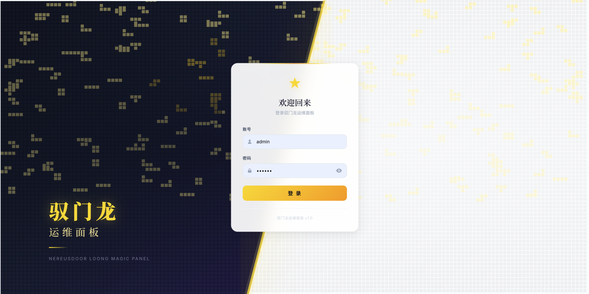

登录页以“驭门龙运维面板”为统一入口，提供管理员身份认证能力。界面采用左右分区与科技感网格背景，突出项目作为服务器运维控制台的安全入口属性。

### 首页系统概览

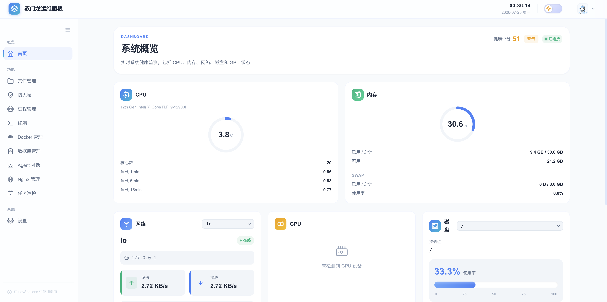

首页将主机资源状态集中呈现，包括健康评分、CPU、内存、网络、GPU、磁盘分区与目录占用等核心指标。运维人员进入系统后可以第一时间判断服务器整体运行状态，并快速定位异常资源。

### 深夜模式系统概览

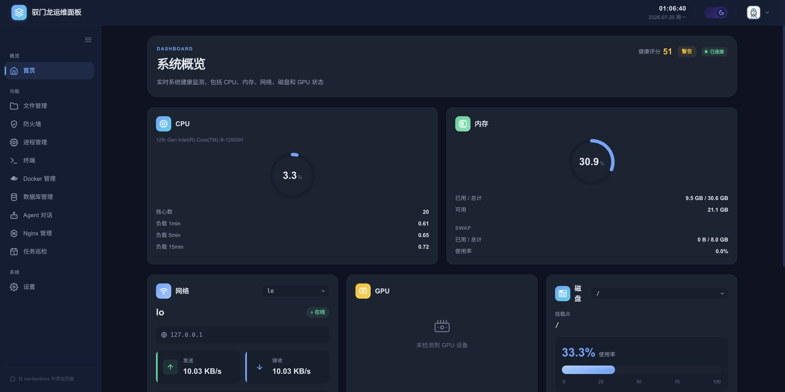

系统支持浅色与深色主题切换，深夜模式适合长时间值守和机房运维场景。相同的数据结构在不同视觉模式下保持一致，兼顾可读性与使用舒适度。

## 文件管理

### 文件浏览

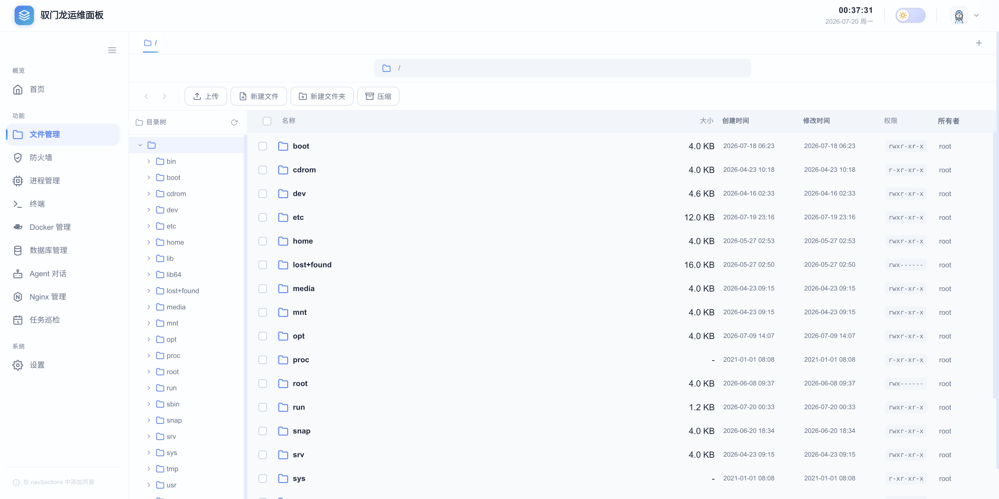

文件管理页面提供目录树、路径导航、文件列表、权限、所有者、更新时间与大小等信息。平台支持上传、新建文件、新建目录和压缩等常见操作，使 Web 面板具备接近服务器文件管理器的能力。

### 文件右键菜单

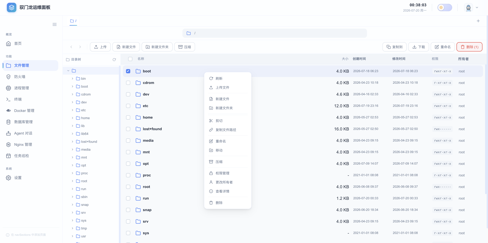

文件右键菜单集成刷新、上传、新建、剪切、复制路径、重命名、移动、压缩、权限管理、所有者变更、详情查看与删除等操作。该设计降低了运维人员在命令行中处理文件的频率，也便于 Agent 与面板操作形成统一审计入口。

## 网络与主机安全

### 防火墙规则管理

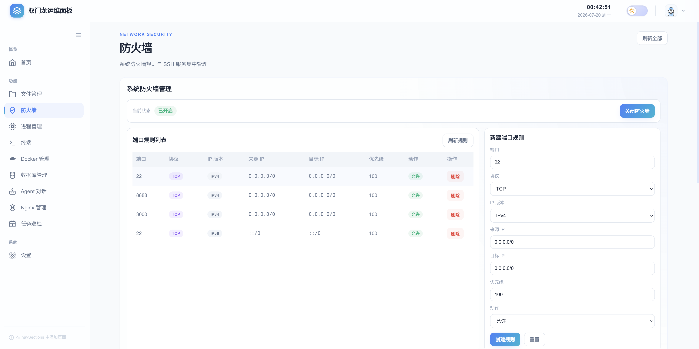

防火墙页面提供系统防火墙状态、端口规则列表和新增规则表单。运维人员可以集中查看 IPv4 / IPv6 端口放行情况，并对 SSH、面板端口和业务端口进行可视化管理。

### SSH 服务与登录审计

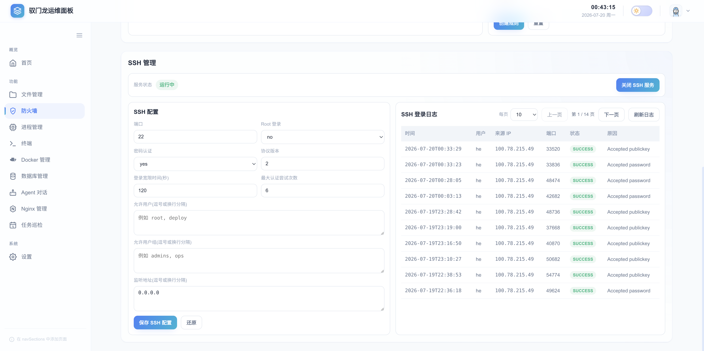

SSH 管理区域展示 SSH 服务状态、端口、root 登录、密码认证、协议版本、超时策略、最大尝试次数、允许用户与监听地址等关键配置，并提供 SSH 登录日志。该能力将网络访问控制与登录审计放在同一工作流中，便于排查异常登录与加固远程入口。

## 进程与终端

### 实时进程管理

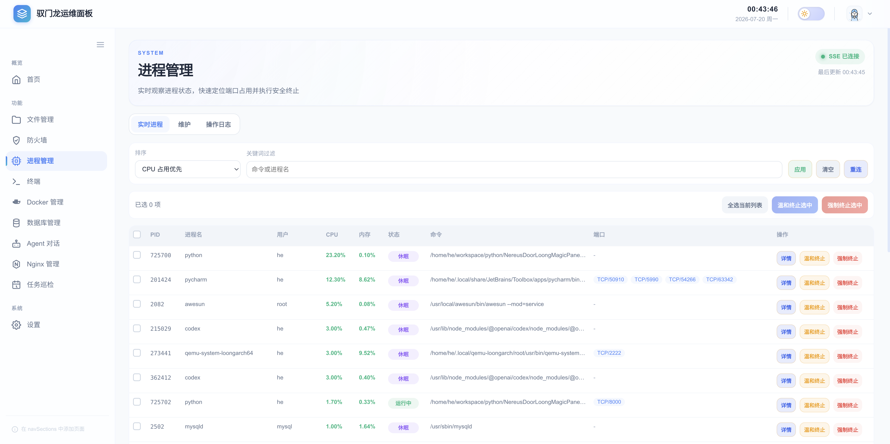

进程管理页面通过实时连接展示进程列表，包含 PID、用户、状态、CPU、内存、命令行和端口占用信息。页面提供温和终止与强制终止能力，适用于定位异常资源占用、排查端口冲突和治理失控进程。

### 端口占用与自动清理

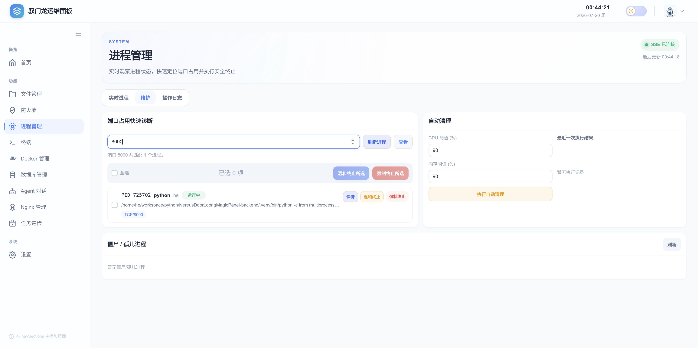

维护视图支持按端口快速检索占用进程，并提供批量温和终止、强制终止和自动清理策略。平台将“查端口、找进程、评估风险、执行终止”整合为可视化流程，减少人工命令组合带来的误操作。

### WebSocket 终端直连

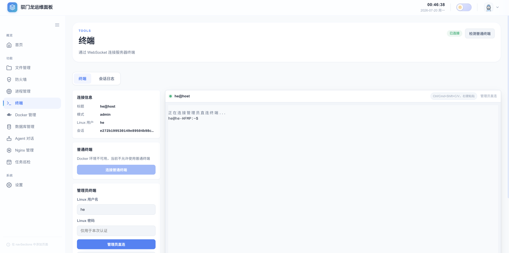

终端页面通过 WebSocket 连接服务器终端，支持管理员直连与普通终端检测。左侧展示连接信息、Linux 用户、会话标识和认证方式，使 Web 终端具备明确的会话边界。

### 终端会话日志

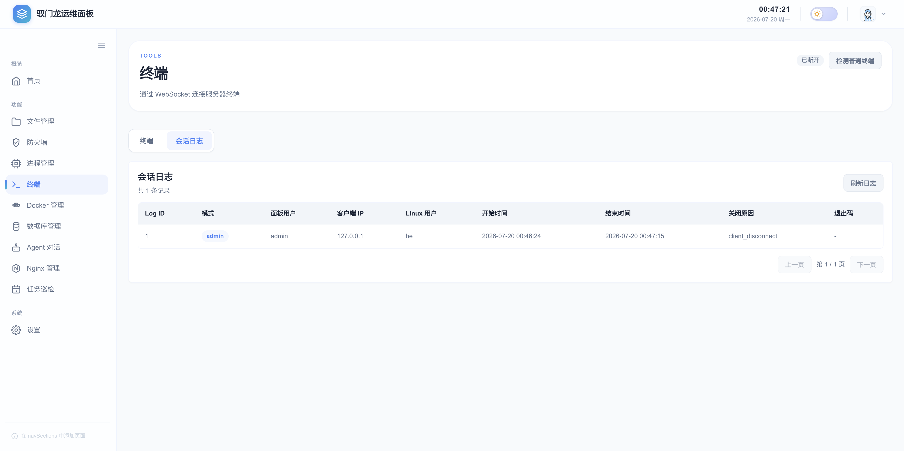

终端日志记录会话模式、面板用户、客户端 IP、Linux 用户、开始时间、结束时间、关闭原因和退出码。对于真实运维环境，终端能力不仅要能连接，更要能回溯谁在何时建立了什么类型的会话。

## 数据库与中间件运维

### 数据库管理

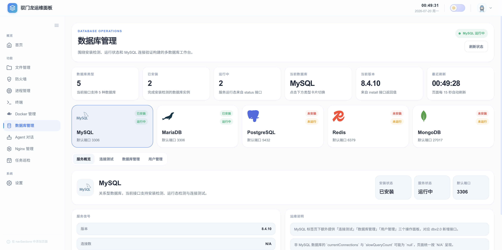

数据库页面支持 MySQL、MariaDB、PostgreSQL、Redis、MongoDB 等多类数据库的安装检测、运行状态检测和连接测试。页面以卡片形式呈现当前数据库类型、版本、运行状态和默认端口，方便运维人员在统一入口管理常见数据服务。

### Nginx 管理

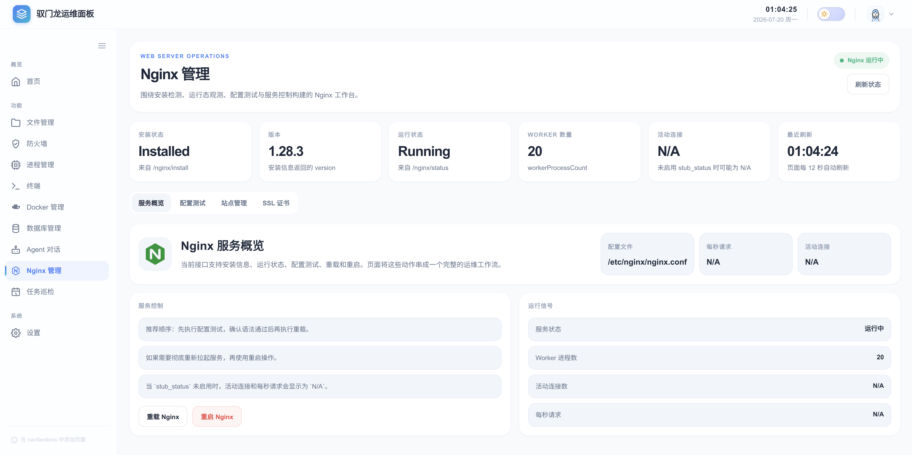

Nginx 页面提供安装状态、版本、运行状态、Worker 数量、配置文件、活动连接和刷新时间等信息，并支持配置测试、站点管理、SSL 证书、reload 和 restart 等操作。该能力面向 Web 服务运维场景，可用于快速完成配置变更前检查和服务控制。

## Docker 容器管理

### 容器工作区

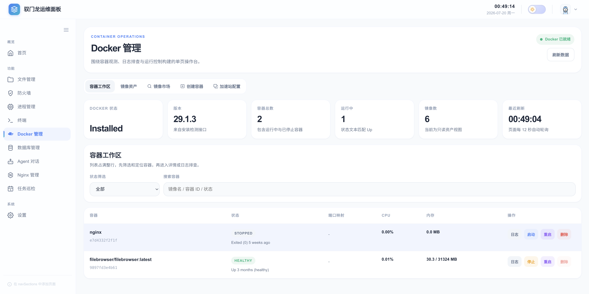

Docker 管理页面展示 Docker 安装状态、版本、容器总数、运行容器数和镜像数量。容器工作区支持按状态筛选、按名称或 ID 搜索，并提供日志、启动、停止、重启和删除等生命周期操作。

### 镜像资产

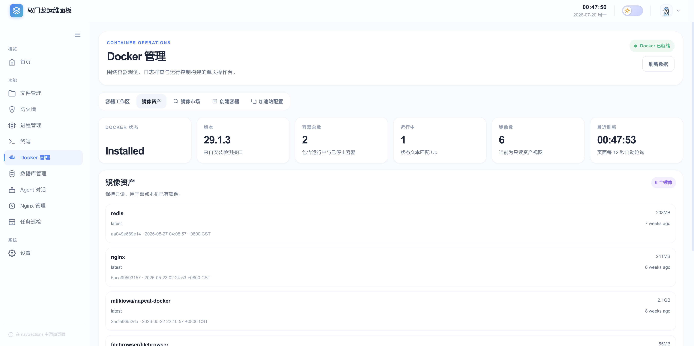

镜像资产页面用于盘点本机已有镜像，展示镜像名称、标签、镜像 ID、创建时间和大小。该视图帮助运维人员清理冗余镜像、核对运行依赖，并为容器创建提供资产基础。

### 镜像市场

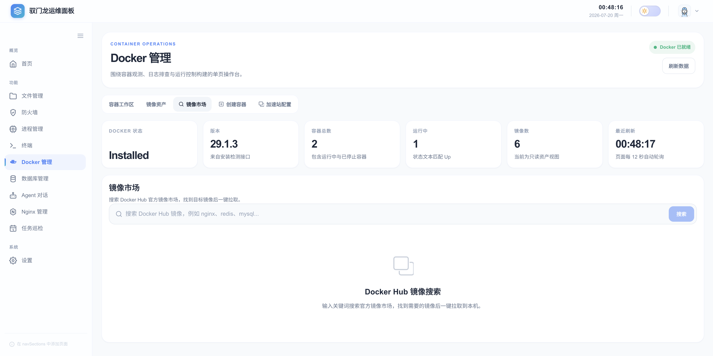

镜像市场支持搜索 Docker Hub 官方镜像，并可在找到目标镜像后一键拉取到本机。平台将镜像检索、镜像拉取与容器创建串联起来，减少运维人员在命令行中手动查找和拼接命令的成本。

### 创建容器

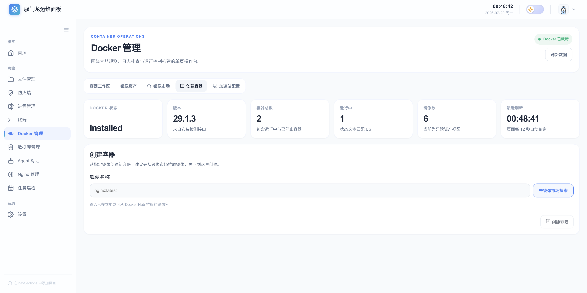

创建容器页面允许用户输入本地或远程镜像名称，并引导先从镜像市场拉取镜像再创建容器。该流程为后续扩展端口映射、卷挂载、环境变量和启动参数提供了清晰的操作入口。

### 镜像加速站配置

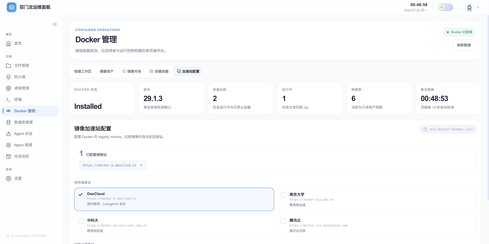

镜像加速配置页面面向国内和 LoongArch 环境的实际部署需求，支持配置 Docker registry mirrors，并展示常用加速站选项。该能力体现平台对国产化服务器环境与容器拉取稳定性的考虑。

## Agent 智能运维与安全护栏

### Agent 对话与预授权任务

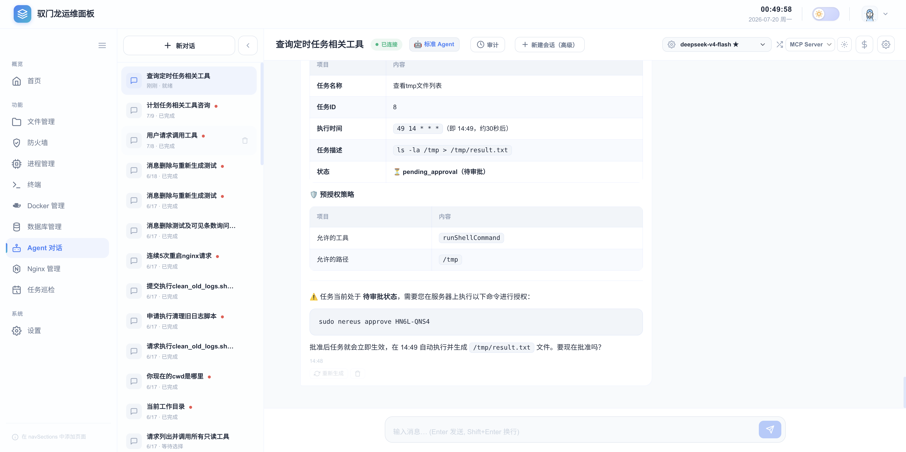

Agent 对话页面展示任务名称、执行时间、任务描述、状态和预授权策略。截图中的任务通过 cron 触发，并限定允许工具与允许路径，说明平台能够将 Agent 能力用于定时运维，同时通过策略限制执行范围。

### Token 用量与计费

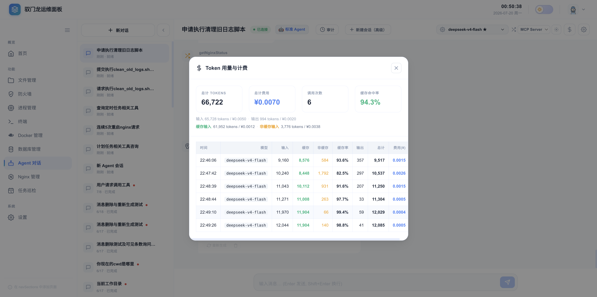

平台提供 Token 用量与计费统计，包括总 Token、总费用、调用次数、缓存命中率、输入输出 Token 和模型明细。该能力让 Agent 运维具备成本可观测性，便于在比赛演示和实际运行中解释模型调用成本。

### Trace 审计时间线

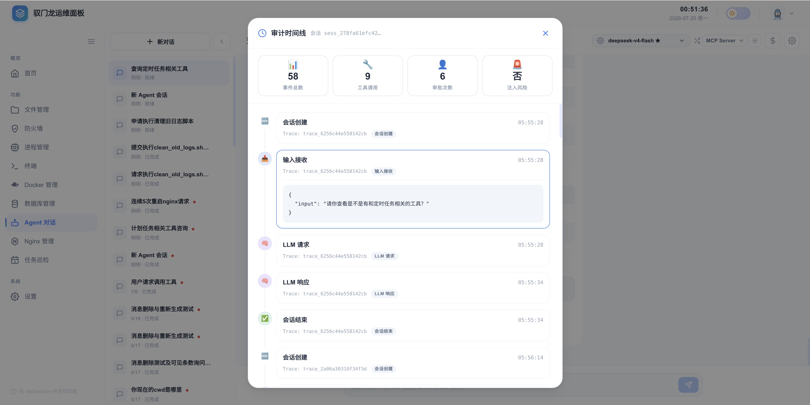

审计时间线记录会话创建、输入接收、LLM 请求、LLM 响应、工具调用、审批和会话结束等事件。平台不是只展示最终回答，而是保留 Agent 推理与执行过程中的关键节点，为问题复盘和安全追责提供依据。

### 计划审批

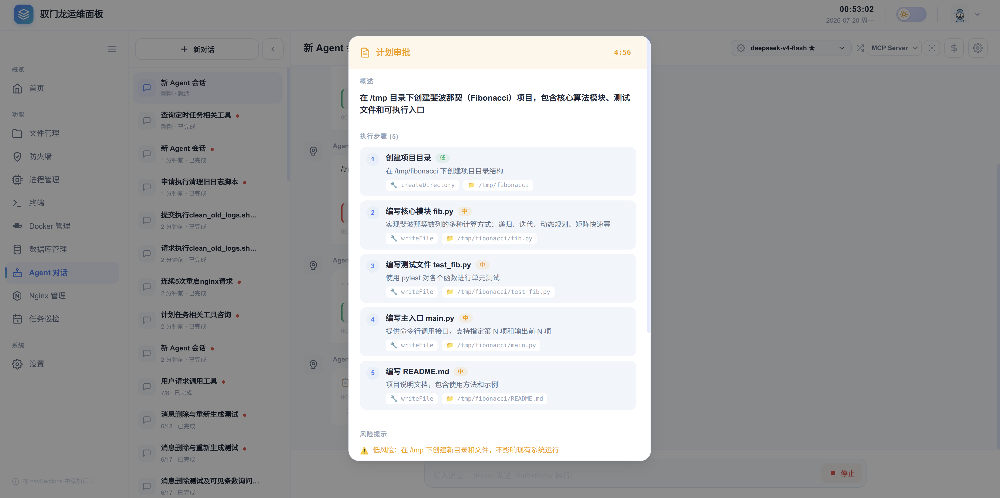

计划审批弹窗展示 Agent 在执行前生成的任务概述、执行步骤、工具名称、目标路径和风险提示。对于写文件、创建目录、运行脚本等操作，系统要求先提交计划并等待管理员确认，在灵活自动化与安全控制之间建立明确边界。

### WebSocket 断连恢复审批

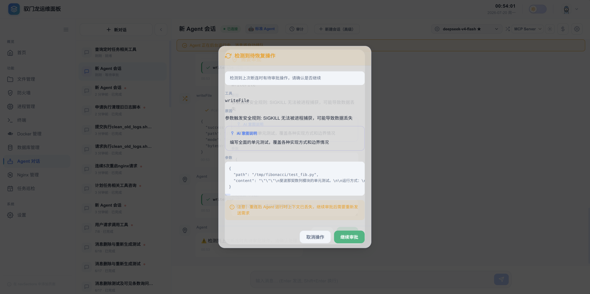

当 WebSocket 连接中断后，平台能够恢复上次待审批操作，并提示继续审批可能存在的上下文丢失风险。该设计解决了真实 Web 场景中的断线、刷新和重连问题，确保关键审批不会因为连接异常而失控执行。

### 高危工具调用审批

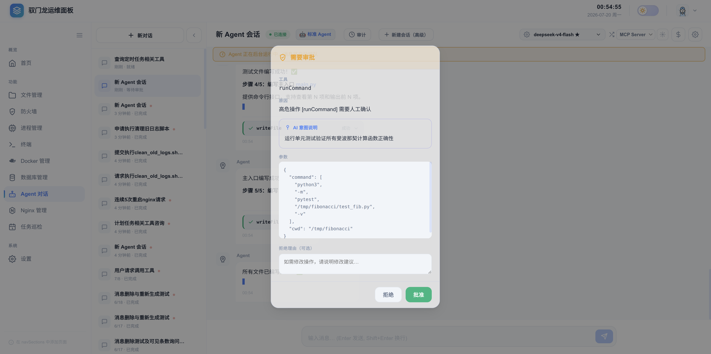

高危工具调用弹窗展示工具名、触发原因、AI 意图说明和完整参数，并允许管理员批准或拒绝。系统强制 Agent 说明调用原因，使审批者不仅看到“要执行什么”，还可以看到“为什么要执行”。

### Agent 申请提权执行脚本

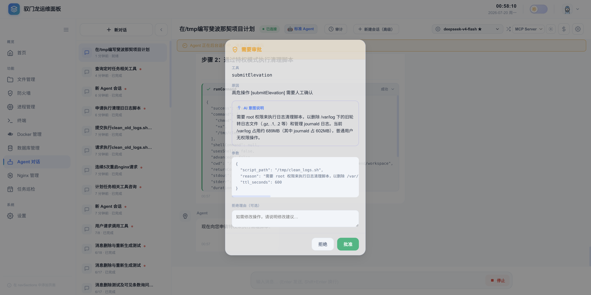

当普通权限无法完成运维动作时，Agent 可以提交提权申请，但不会直接获得 root 权限。截图中提权申请包含脚本路径、理由、超时时间和风险说明，体现了“允许 Agent 提出高权限需求，但必须由人类授权”的安全设计。

### 前端特权审批提示

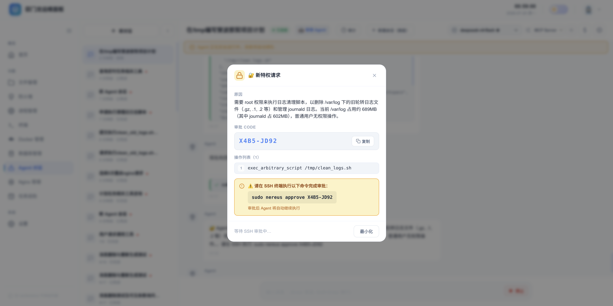

特权审批弹窗生成一次性审批码，并明确提示需要在 SSH 终端执行 `sudo nereus approve` 完成审批。前端只负责呈现申请和审批入口，真正的 root 级批准必须由具备 sudo 权限的系统用户在服务器侧完成。

### CLI 发起 sudo 审批

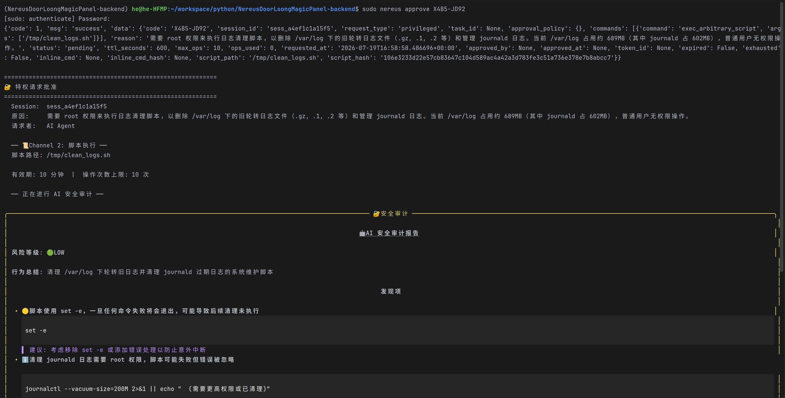

CLI 审批界面展示会话 ID、申请原因、请求者、脚本路径、有效期和操作次数上限。审批命令运行在 sudo 上下文中，能够确认审批者具备系统级权限，同时避免 Web 后端长期持有 root 权限。

### 第三方 AI 脚本安全审计

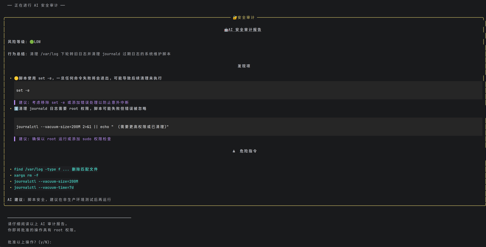

CLI 审批过程中会触发 AI 安全审计，对脚本行为、潜在风险、危险指令和修复建议进行分析。该机制为人工审批提供第二视角，避免审批者只凭文件名或 Agent 描述放行高权限操作。

### Token 交接与特权执行

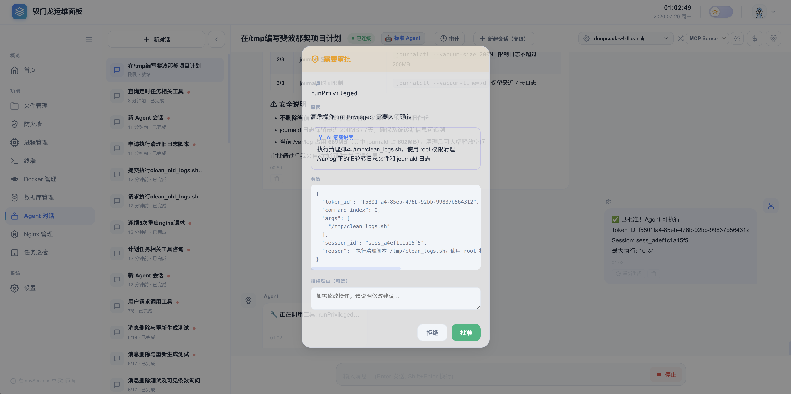

审批通过后，系统向 Agent 返回受限执行 Token，Token 绑定会话、命令索引、参数、最大执行次数和有效期。随后 Agent 调用 `runPrivileged` 执行受控特权动作，实现“审批权在 sudo 用户，执行权受 Token 约束”的安全闭环。

## 自动化任务与巡检

### 定时任务

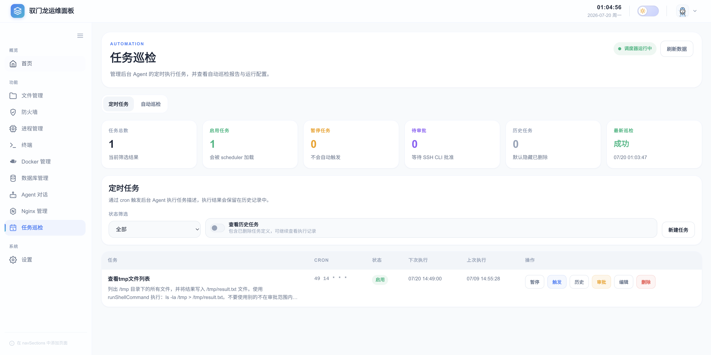

任务巡检页面提供定时任务管理能力，展示任务总数、启用任务、暂停任务、待审批任务、历史任务和最新巡检状态。任务列表包含 CRON 表达式、状态、下次执行时间、上次执行时间，以及暂停、触发、历史、审批、编辑和删除等操作。

### 自动巡检报告

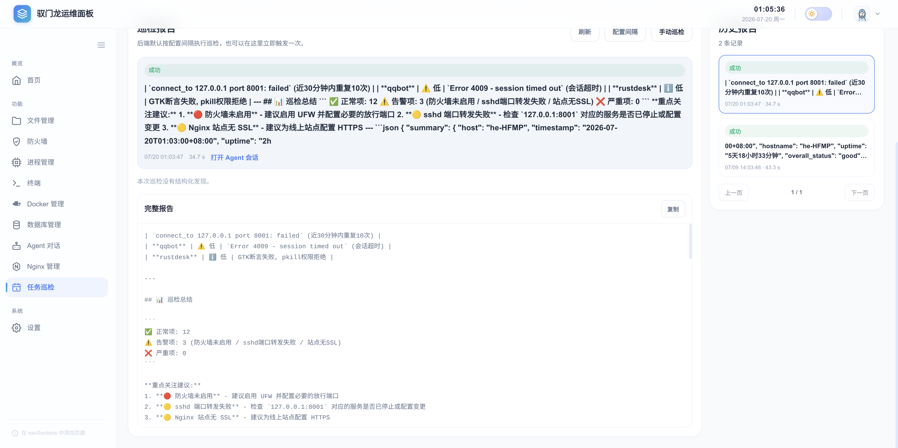

自动巡检报告将 Agent 的检查结果沉淀为可阅读的运维报告，包含正常项、告警项、严重项和重点建议。平台支持查看历史报告、复制完整报告并跳转到关联 Agent 会话，形成“定时发现、报告沉淀、会话追溯”的自动化运维流程。

## 系统设置

### 偏好与凭证管理

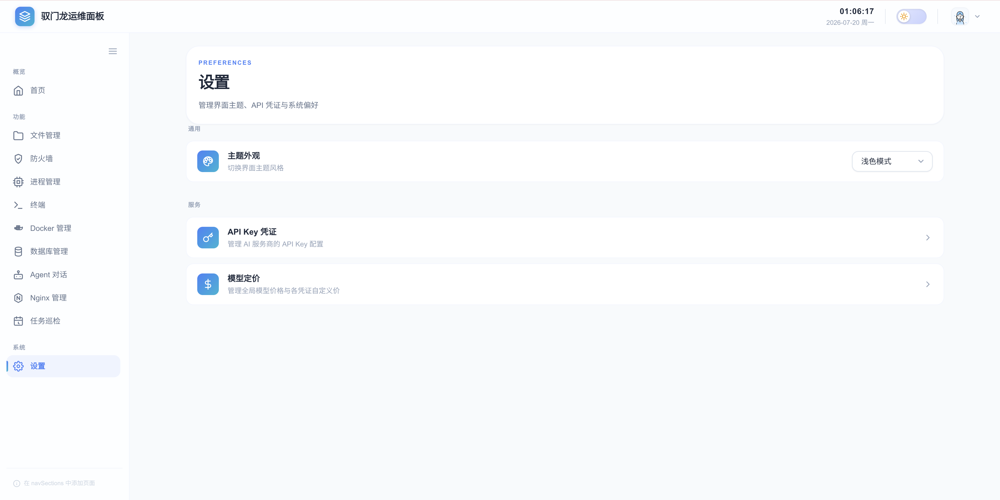

设置页面提供主题外观、API Key 凭证和模型定价配置入口。该能力使平台可以在不同模型服务商、不同成本策略和不同展示主题之间切换，为长期运行和演示部署提供基础配置能力。

## 展示总结

从以上界面可以看到，本项目已经形成完整的智能运维产品闭环：

- 面板层覆盖文件、进程、防火墙、终端、Docker、数据库、Nginx、定时任务和巡检等实际运维功能。
- Agent 层支持自然语言任务、计划提交、工具调用、成本统计、Trace 审计和断线恢复。
- 安全层通过计划审批、高危工具审批、特权代理、CLI sudo 审批、第三方 AI 脚本审计和受限 Token 执行，将高风险操作纳入可解释、可确认、可追溯的管控链路。
- 自动化层将定时任务与 Agent 巡检结合，使系统不仅能响应人工请求，也能周期性发现问题并沉淀报告。

因此，NereusDoorLoongMagicPanel 不只是一个 Agent 后端，而是一套面向真实服务器场景设计的安全智能运维一站式平台。
